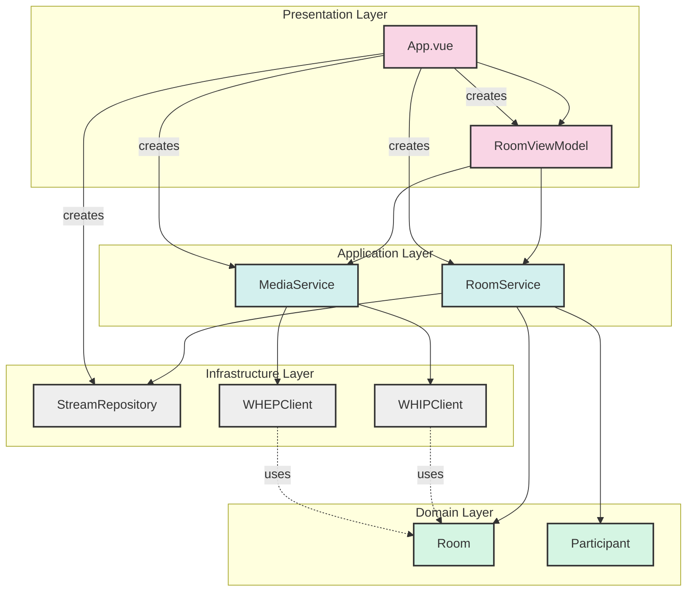

# Component Dependencies

This diagram illustrates the dependencies between the main components of the application.

The diagram shows:
- How components are organized into layers
- Direct dependencies between components (solid arrows)
- Instantiation relationships (dashed arrows)
- Usage relationships (dotted arrows)

Each layer is color-coded for clarity:
- Presentation layer (pink)
- Application layer (light blue)
- Infrastructure layer (light gray)
- Domain layer (light green) 