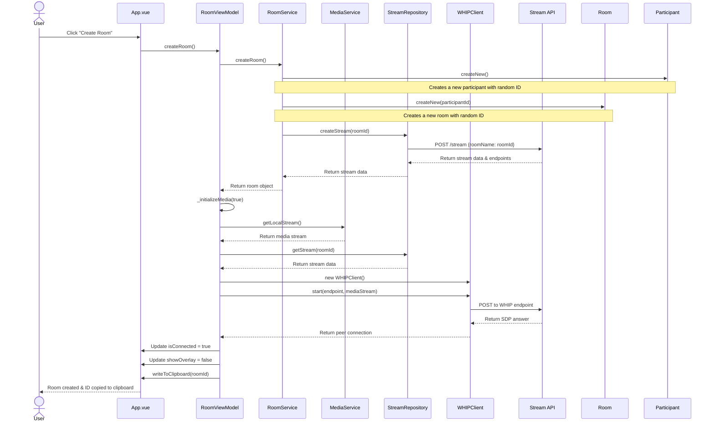

# Create Room Flow

This diagram illustrates the sequence of operations when a user creates a new room.

The diagram shows:
1. User initiates room creation
2. Domain objects (Room and Participant) are created
3. API interaction to create a stream
4. Media stream initialization
5. WebRTC connection setup with WHIP
6. UI updates and clipboard copying

This flow demonstrates how the application layers interact while maintaining separation of concerns. 