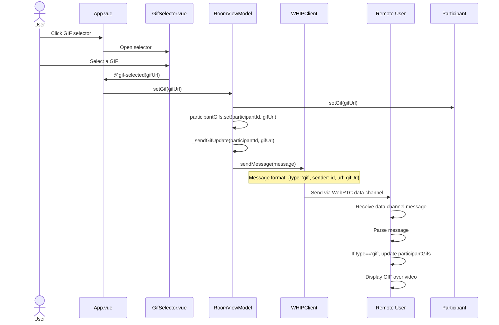

# GIF Sharing Flow

This diagram illustrates the flow of selecting and sharing GIFs with other participants.

The diagram shows:
1. User interaction with the GIF selector component
2. How the selected GIF is processed through the view model
3. How the domain model is updated
4. How the GIF information is shared through WebRTC data channels
5. How remote users receive and display the GIF

This flow demonstrates the clean separation between UI components, application logic, and communication infrastructure while using the WebRTC data channel for real-time communication. 