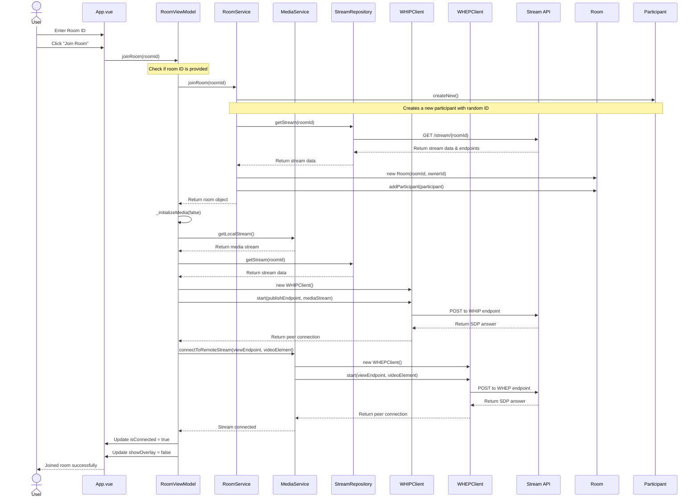

# Join Room Flow

This diagram illustrates the sequence of operations when a user joins an existing room.

The diagram shows:
1. User enters a room ID and initiates joining
2. Input validation
3. Domain object creation for the local participant
4. API interaction to get stream information
5. Room object creation with the participant
6. Media stream initialization
7. WebRTC connection setup for both publishing (WHIP) and viewing (WHEP)
8. UI updates

This flow demonstrates the separation between UI interaction, domain logic, and external services. 