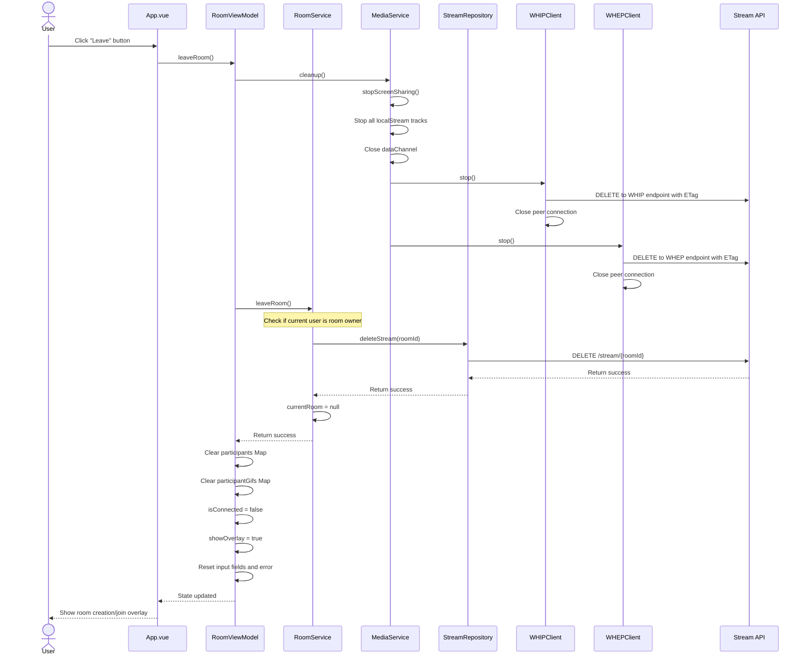

# Leave Room Flow

This diagram illustrates the sequence of operations when a user leaves a room.

The diagram shows:
1. User initiates leaving a room
2. Media resources cleanup (streams, WebRTC connections)
3. Domain layer handling of leaving the room
4. API interaction to delete the stream if the user is the owner
5. UI state reset
6. Application returns to initial state

This flow demonstrates clean resource management and proper cleanup when a user leaves the room, preventing memory leaks and ensuring streams are properly terminated. 