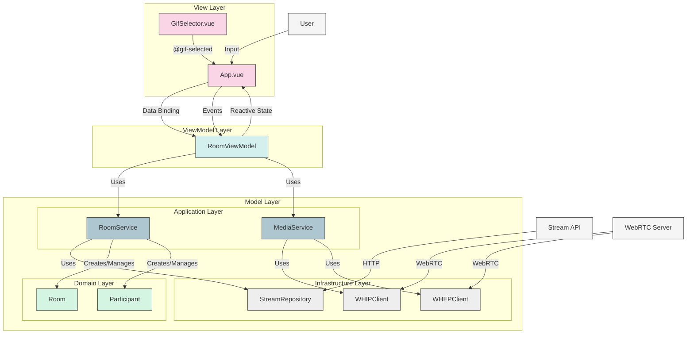

# MVVM Architecture

This diagram illustrates how the Model-View-ViewModel (MVVM) pattern is implemented in the application.

## MVVM Pattern Implementation

In this application:

1. **View Layer**
   - Contains UI components (Vue components)
   - Binds to properties exposed by the ViewModel
   - Forwards user actions to the ViewModel
   - Has no knowledge of the Model layer

2. **ViewModel Layer**
   - Exposes data and commands for the View
   - Encapsulates presentation logic
   - Converts Model data to View-friendly format
   - Uses reactive properties (Vue's ref/reactive) for data binding

3. **Model Layer**
   - **Domain**: Pure business logic (Room, Participant)
   - **Application**: Coordinates use cases (Services)
   - **Infrastructure**: External interactions (Repositories, WebRTC clients)

## Data Flow

1. **User Input** → **View** → **ViewModel** → **Model** → External systems
2. **External Data** → **Model** → **ViewModel** → **View** → **User**

This architecture enables:
- Clean separation of concerns
- Testability of each layer in isolation
- Maintainability of the codebase
- Reusability of components 