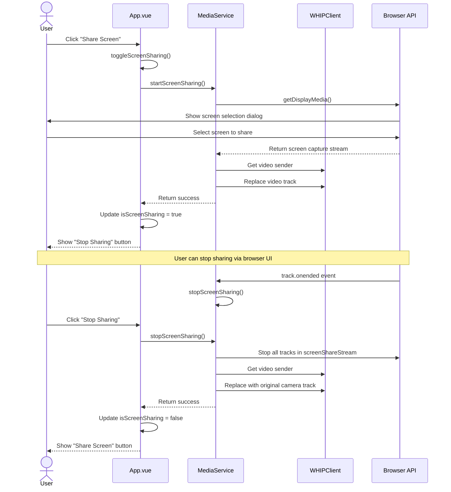

# Screen Sharing Flow

This diagram illustrates how screen sharing is implemented in the application.

This diagram shows:
1. How the user initiates screen sharing
2. How the browser's screen capture API is used
3. How the WebRTC video track is replaced with the screen capture
4. How stopping screen sharing works (both via app UI and browser UI)
5. How the original video track is restored when sharing ends

The screen sharing feature demonstrates how the application cleanly separates UI concerns from media handling logic. 